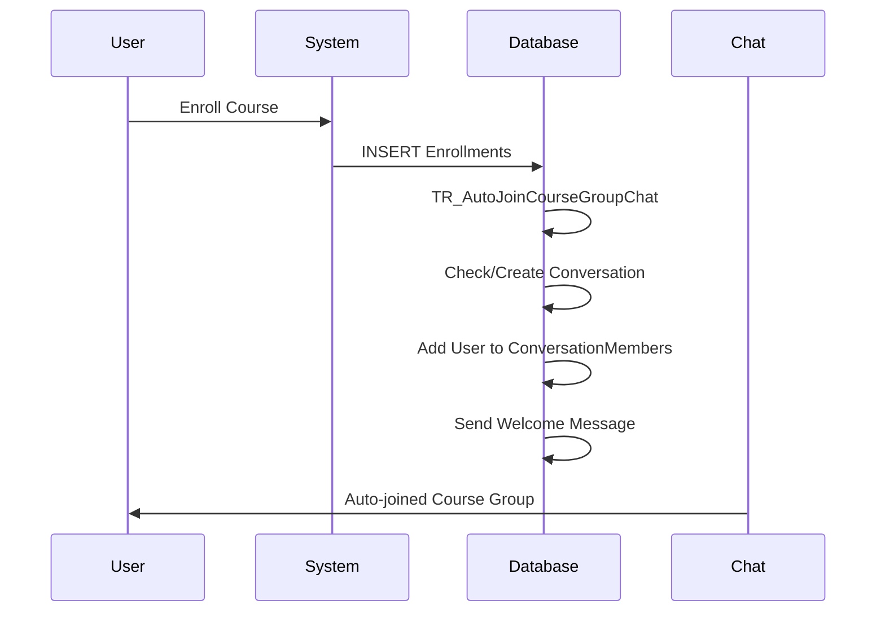
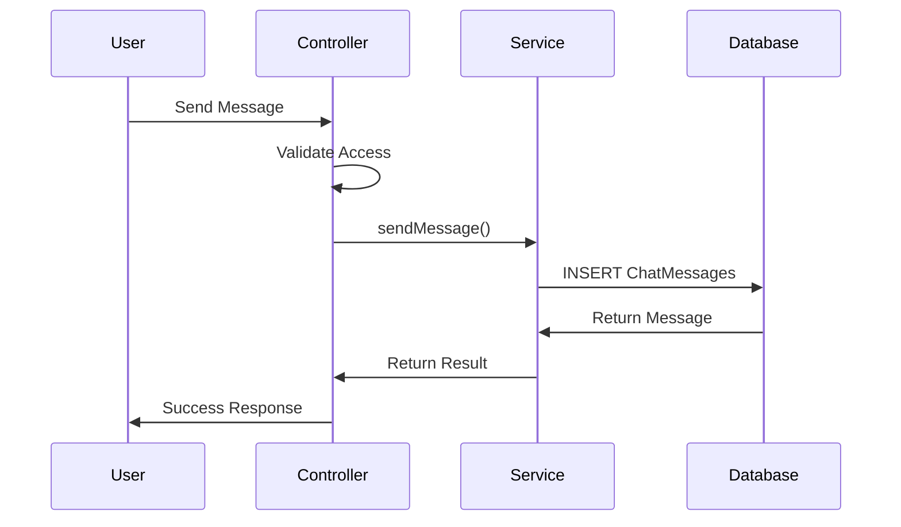

# 🎓 Course Group Chat System - WebSocket Implementation

## 📋 Tổng quan

Hệ thống chat group member cho khóa học được phát triển theo mô hình MVC với các tính năng:

- **Auto-Join**: Tự động thêm user vào group chat khi đăng ký khóa học
- **Real-time Chat**: Chat real-time với WebSocket (planned)
- **Group Management**: Quản lý members trong group
- **Message History**: Lưu trữ và hiển thị lịch sử tin nhắn

## 🏗️ Kiến trúc hệ thống

### Model-View-Controller (MVC)
```
📁 src/java/
├── 📁 model/
│   ├── Conversations.java      # Entity conversation
│   ├── ChatMessages.java       # Entity tin nhắn
│   ├── ConversationMembers.java # Entity member
│   ├── Users.java              # Entity user
│   └── Courses.java            # Entity khóa học
├── 📁 controller/
│   └── ChatController.java     # Controller xử lý chat
├── 📁 services/
│   ├── ChatService.java        # Interface service
│   └── ChatServiceImpl.java    # Implementation service
├── 📁 servlet/
│   └── ChatAPIServlet.java     # REST API servlet
└── 📁 websocket/
    └── CourseGroupChatEndpoint.java # WebSocket endpoint (planned)
```

### Database Schema
```sql
-- Bảng chính cho chat system
Conversations        -- Group chat information
ConversationMembers  -- Members in groups  
ChatMessages         -- Messages history
Users               -- User information
Courses             -- Course information
Enrollments         -- Course enrollments

-- Trigger tự động
TR_AutoJoinCourseGroupChat -- Auto-join when enroll
```

## 🚀 Các tính năng đã triển khai

### ✅ Service Layer
- `ChatService`: Interface định nghĩa các operation
- `ChatServiceImpl`: Business logic implementation
- Auto-create course conversation
- Auto-add user to course group
- Message sending/receiving
- Member management

### ✅ Controller Layer  
- `ChatController`: Thin controller delegate to services
- Handle enrollment -> auto-join
- Validate user access
- Get conversation info

### ✅ Database Integration
- SQL trigger auto-join course group
- Conversation management
- Message history storage
- Member relationship tracking

### ✅ Web Interface
- `course_group_chat.jsp`: Main chat interface
- `demo_course_chat.jsp`: Demo auto-join functionality
- Responsive design
- Real-time refresh (polling)

## 📊 Database Trigger

Trigger `TR_AutoJoinCourseGroupChat` tự động:

1. **Khi user enroll vào course**:
   - Kiểm tra course đã có group chat chưa
   - Nếu chưa có: Tạo conversation mới
   - Thêm instructor làm admin
   - Thêm user vào group
   - Gửi welcome message

2. **Smart conversation naming**:
   ```
   Nhóm học: [Course Title] [CourseId:uuid]
   ```

## 🔧 API Endpoints

### REST API (`/api/chat/*`)

```http
GET /api/chat/conversations?userId={id}
# Lấy danh sách conversations của user

GET /api/chat/messages/{conversationId}?limit=50  
# Lấy lịch sử tin nhắn

GET /api/chat/members/{conversationId}
# Lấy danh sách members

POST /api/chat/send
# Gửi tin nhắn
# Params: conversationId, senderId, content

POST /api/chat/join  
# Auto-join course group
# Params: userId, courseId
```

## 🎯 Demo & Test

### 1. Demo Auto-Join
```url
http://localhost:8080/adaptive_elearning/demo_course_chat.jsp
```

### 2. Chat Interface
```url  
http://localhost:8080/adaptive_elearning/course_group_chat.jsp?userId=9f32b3ba-e7c5-4f58-81b8-8096f6f99c79
```

### 3. Sample Data
```sql
-- Sample User ID
9f32b3ba-e7c5-4f58-81b8-8096f6f99c79

-- Sample Course ID  
550e8400-e29b-41d4-a716-446655440000
```

## 🔄 Flow hoạt động

### Auto-Join Course Group


### Send Message Flow


## 🛠️ Setup Instructions

### 1. Database Setup
```sql
-- Chạy CourseHubDB.sql để tạo database và trigger
-- Trigger TR_AutoJoinCourseGroupChat đã được include
```

### 2. Dependencies
```xml
<!-- Servlet API -->
<dependency>
    <groupId>jakarta.servlet</groupId>
    <artifactId>jakarta.servlet-api</artifactId>
</dependency>

<!-- SQL Server JDBC -->
<dependency>
    <groupId>com.microsoft.sqlserver</groupId>
    <artifactId>mssql-jdbc</artifactId>
</dependency>
```

### 3. Configuration
```java
// DBConnection.java - Update connection string
String connectionUrl = "jdbc:sqlserver://localhost:1433;databaseName=CourseHubDB;encrypt=true;trustServerCertificate=true;";
```

## 🎨 WebSocket Implementation (Planned)

### Architecture
```java
@ServerEndpoint("/chat/{conversationId}")
public class CourseGroupChatEndpoint {
    // Real-time messaging
    // User presence
    // Typing indicators
    // Message delivery status
}
```

### Features to implement
- [ ] Real-time message delivery
- [ ] User online status
- [ ] Typing indicators  
- [ ] Message read receipts
- [ ] File sharing
- [ ] Emoji reactions

## 🧪 Testing

### Unit Tests
```java
// Test auto-join functionality
ChatController.handleCourseEnrollment()

// Test message sending
ChatService.sendMessage()

// Test access validation
ChatController.validateUserAccess()
```

### Integration Tests
```sql
-- Test trigger execution
INSERT INTO Enrollments (CreatorId, CourseId, Status, CreationTime, AssignmentMilestones, LectureMilestones, SectionMilestones)
VALUES ('test-user-id', 'test-course-id', 'Active', GETDATE(), '[]', '[]', '[]')

-- Verify conversation created
SELECT * FROM Conversations WHERE Title LIKE '%test-course%'

-- Verify member added  
SELECT * FROM ConversationMembers WHERE ConversationId = 'conversation-id'
```

## 📈 Performance Considerations

### Database Optimization
- Index on ConversationMembers(CreatorId, ConversationId)
- Index on ChatMessages(ConversationId, CreationTime)
- Conversation title optimization for course lookup

### Caching Strategy
- Cache conversation memberships
- Cache recent messages
- User session management

## 🔒 Security Features

### Access Control
- User must be member to access conversation
- Validate user permissions before message send
- Sanitize message content

### Data Validation
- Input validation for all parameters
- SQL injection prevention
- XSS protection in messages

## 📝 Changelog

### v1.0 (Current)
- ✅ Service layer implementation
- ✅ Auto-join course groups
- ✅ Basic chat functionality
- ✅ Database trigger
- ✅ Demo interface

### v1.1 (Planned)
- 🔄 WebSocket real-time chat
- 🔄 Enhanced UI/UX
- 🔄 File sharing
- 🔄 Push notifications

## 👥 Contributors

- **Developer**: Adaptive E-Learning Team
- **Architecture**: MVC Pattern
- **Database**: SQL Server with triggers
- **Frontend**: JSP with responsive design

## 📞 Support

For issues and questions:
1. Check the demo pages first
2. Review database trigger logs
3. Test with sample data provided
4. Check browser console for errors

---

**Happy Coding! 🚀**