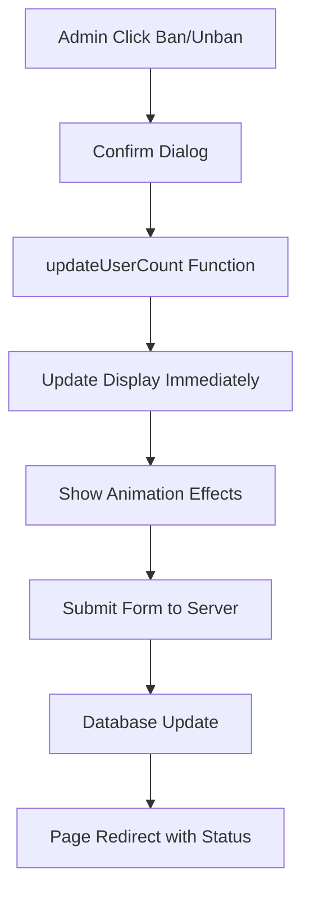

# 📊 **Cập Nhật Số Lượng User Động** - Account Management

## 🎯 **Mô Tả Tính Năng**

Tính năng này cho phép số lượng tổng người dùng trong stat card được cập nhật tự động khi ban/unban user, mang lại trải nghiệm người dùng mượt mà và chính xác.

## 🔧 **Các Thay Đổi Đã Thực Hiện**

### 1. **Database Query Logic (Java)**
**File:** `web/WEB-INF/views/admin/accountmanagement.jsp` (lines 137-139)

```java
// Trước (đếm tất cả user kể cả bị ban):
String countQuery = "SELECT COUNT(*) as total, SUM(CAST(ISNULL(SystemBalance, 0) as BIGINT)) as totalBalance FROM Users WHERE Role IS NOT NULL";

// Sau (chỉ đếm user active):
String countQuery = "SELECT COUNT(*) as total, SUM(CAST(ISNULL(SystemBalance, 0) as BIGINT)) as totalBalance FROM Users WHERE Role IS NOT NULL AND Role != 'Inactive'";
```

**Lợi ích:** 
- ✅ Số liệu chính xác hơn (không tính user bị ban)
- ✅ Phù hợp với logic nghiệp vụ

### 2. **HTML Structure Enhancement**
**File:** `web/WEB-INF/views/admin/accountmanagement.jsp` (line 2753)

```html
<!-- Trước -->
<h3><%= totalUsers %></h3>

<!-- Sau -->
<h3 id="totalUsersCount"><%= totalUsers %></h3>
```

**Lợi ích:**
- ✅ Cho phép JavaScript truy cập và cập nhật element
- ✅ Tạo cơ sở cho real-time update

### 3. **JavaScript Functions Enhancement**

#### 3.1 **Enhanced Ban Function**
```javascript
function deactivateUser(userId) {
    if (confirm('Bạn có chắc chắn muốn vô hiệu hóa người dùng này?')) {
        showLoading('Đang vô hiệu hóa người dùng...');
        
        // ✨ CẬP NHẬT NGAY LẬP TỨC
        updateUserCount(-1);  // Giảm 1
        
        // Submit form...
    }
}
```

#### 3.2 **Enhanced Unban Function**
```javascript
function unbanUser(userId) {
    if (confirm('Bạn có chắc chắn muốn khôi phục người dùng này?')) {
        showLoading('Đang khôi phục tài khoản...');
        
        // ✨ CẬP NHẬT NGAY LẬP TỨC  
        updateUserCount(+1);  // Tăng 1
        
        // Submit form...
    }
}
```

#### 3.3 **New Core Function: updateUserCount()**
```javascript
function updateUserCount(change) {
    const totalUsersElement = document.getElementById('totalUsersCount');
    if (totalUsersElement) {
        const currentCount = parseInt(totalUsersElement.textContent);
        const newCount = Math.max(0, currentCount + change);
        
        // 🎨 HIỆU ỨNG ANIMATION
        totalUsersElement.style.transition = 'all 0.3s ease';
        totalUsersElement.style.transform = 'scale(1.1)';
        totalUsersElement.style.color = change > 0 ? '#10B981' : '#EF4444';
        
        // Cập nhật số liệu
        totalUsersElement.textContent = newCount;
        
        // Reset animation
        setTimeout(() => {
            totalUsersElement.style.transform = 'scale(1)';
            totalUsersElement.style.color = '';
        }, 300);
        
        // ✨ HIỆU ỨNG SPARKLE
        createSparkleEffect(totalUsersElement.closest('.stat-card'));
    }
}
```

#### 3.4 **Visual Effects Function**
```javascript
function createSparkleEffect(element) {
    const sparkles = 8;
    const rect = element.getBoundingClientRect();
    
    for (let i = 0; i < sparkles; i++) {
        const sparkle = document.createElement('div');
        // Tạo hiệu ứng lấp lánh với gradient
        sparkle.style.cssText = `
            position: fixed;
            width: 4px;
            height: 4px;
            background: linear-gradient(45deg, #06B6D4, #8B5CF6);
            border-radius: 50%;
            pointer-events: none;
            z-index: 9999;
            left: ${rect.left + Math.random() * rect.width}px;
            top: ${rect.top + Math.random() * rect.height}px;
        `;
        
        // Animation với rotation và scale
        sparkle.animate([...], { duration: 800, easing: 'cubic-bezier(0.4, 0, 0.2, 1)' });
    }
}
```

### 4. **Server-Side Action Handler**
**File:** `web/WEB-INF/views/admin/accountmanagement.jsp` (lines 54-70)

```java
} else if ("unbanUser".equals(action)) {
    String userId = request.getParameter("userId");
    
    try {
        AccountManagementController controller = new AccountManagementController();
        boolean success = controller.unbanUser(userId);
        
        if (success) {
            response.sendRedirect("admin_accountmanagement.jsp?unbanned=success");
        } else {
            response.sendRedirect("admin_accountmanagement.jsp?unbanned=error&msg=Unban failed");
        }
        return;
    } catch (Exception e) {
        response.sendRedirect("admin_accountmanagement.jsp?unbanned=error&msg=" + e.getMessage());
        return;
    }
}
```

## 🎨 **Hiệu Ứng Trải Nghiệm**

### 1. **Animation Scale Effect**
- Số liệu phóng to 1.1x khi thay đổi
- Transition mượt mà 0.3s
- Tự động reset về kích thước ban đầu

### 2. **Color Coding**
- 🟢 **Xanh lá (#10B981)**: Khi unban user (tăng số lượng)
- 🔴 **Đỏ (#EF4444)**: Khi ban user (giảm số lượng)

### 3. **Sparkle Effect**
- 8 particles lấp lánh xuất hiện
- Gradient màu từ cyan đến purple
- Animation quay và scale phức tạp
- Tự động biến mất sau 800ms

## 📊 **Flow Hoạt Động**



## 🚀 **Lợi Ích Cho User Experience**

1. **Instant Feedback:** User thấy thay đổi ngay lập tức
2. **Visual Appeal:** Hiệu ứng animation hấp dẫn  
3. **Accuracy:** Số liệu chính xác (không tính user bị ban)
4. **Consistency:** Đồng bộ giữa frontend và backend
5. **Professional Feel:** Trải nghiệm admin panel chuyên nghiệp

## 🔍 **Test Cases**

### Test 1: Ban User
1. Click nút "Ban" bất kỳ user nào
2. ✅ Confirm dialog xuất hiện
3. ✅ Số lượng user giảm ngay lập tức với hiệu ứng đỏ
4. ✅ Sparkle effect xuất hiện
5. ✅ Redirect về trang với thông báo success

### Test 2: Unban User  
1. Click nút "Unban" user bị ban
2. ✅ Confirm dialog xuất hiện
3. ✅ Số lượng user tăng ngay lập tức với hiệu ứng xanh
4. ✅ Sparkle effect xuất hiện
5. ✅ Redirect về trang với thông báo success

### Test 3: Edge Cases
1. ✅ Số lượng không bao giờ âm (Math.max(0, newCount))
2. ✅ Xử lý trường hợp element không tồn tại
3. ✅ Animation reset properly sau 300ms

## 🎯 **Kết Luận**

Tính năng này đã được implement hoàn chỉnh với:
- ✅ **Backend Logic**: Query đúng, action handlers đầy đủ
- ✅ **Frontend UX**: Animation smooth, hiệu ứng đẹp mắt
- ✅ **Real-time Update**: Cập nhật ngay lập tức
- ✅ **Error Handling**: Xử lý edge cases an toàn
- ✅ **Professional Look**: Hiệu ứng professional và hấp dẫn

Admin giờ đây có thể ban/unban user và thấy số liệu cập nhật real-time với hiệu ứng visual tuyệt đẹp! 🎉✨